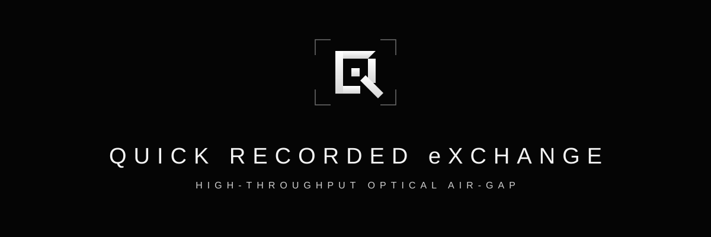

<p align="center">
  
</p>

<p align="center">
  <a href="https://www.rust-lang.org/"></a>
  <a href="https://doc.rust-lang.org/edition-guide/rust-2024/"></a>
  <a href="LICENSE"></a>
  
  
  
</p>

<p align="center">
  <strong>Fast, native desktop suite in Rust for transferring arbitrary files through optical QR code video streams.</strong><br>
  Built for high-density 1080p / 4K / 60 FPS+ optical channels, air-gapped machine transfers, and automated forensic pipelines.
</p>

<p align="center">
  <a href="#features">Features</a> •
  <a href="#architecture">Architecture</a> •
  <a href="#prerequisites">Prerequisites</a> •
  <a href="#installation--build">Installation</a> •
  <a href="#usage">Usage</a> •
  <a href="#protocol-specification-fq1">Protocol (FQ1)</a> •
  <a href="#performance--tuning">Tuning</a> •
  <a href="#development">Development</a>
</p>

---

## Overview

**Quick Recorded eXchange (QRX)** provides an end-to-end, high-throughput optical bridge that encodes arbitrary digital payloads into dynamic video streams and extracts them back with bit-perfect cryptographic verification.

Whether moving data into physically isolated air-gapped workstations or conducting secure optical data exfiltration audits, QRX avoids USB drives, network interfaces, and RF transceivers entirely.

The suite bundles two complementary tools:
1. **Extractor (`qr-video-extractor`)**: A multi-threaded, parallel video decoder that streams frames from FFmpeg directly into dynamic ZBar worker pools with zero memory bloat and two-pass recovery.
2. **Encoder (`qr-video-encoder`)**: A dual GUI / headless CLI broadcaster capable of real-time screen playback and direct H.264 MP4 video rendering with resilient frame holds.

---

## Features

### Extractor (Decoder)

- **Parallel Worker Pipeline**: Distributes incoming video frames across CPU worker threads via dynamic C-bindings to native ZBar (`libzbar`), maximizing CPU core saturation.
- **Bounded Streaming Architecture**: Streams raw Y8 grayscale frames directly from FFmpeg pipes into a bounded queue with automatic back-pressure, maintaining flat memory usage regardless of video size or duration.
- **Adaptive Frame Sampling**: Automatically calibrates scan stride to source framerate while discarding visually identical static frames via fast perceptual hash diffing.
- **Two-Pass Recovery Engine**: Executes an adaptive high-speed scan first; if any packet remains missing, automatically triggers an exhaustive frame-by-frame fallback pass to ensure 100% data recovery.
- **Cryptographic Assembly**: Reassembles chunks strictly according to protocol metadata and validates payloads against full SHA-256 digests prior to writing to disk.
- **Safe Output Storage**: Detects file types and writes recovered files into a dedicated `Recovered from QR/` directory beside the source video, appending non-colliding numeric suffixes when needed.
- **Native GUI with egui**: Minimalist, low-latency desktop interface featuring drag-and-drop ingestion, real-time packet progress bars, live file cards, and instant cancellation.

### Encoder (Broadcaster & Video Generator)

- **Real-Time Screen Broadcaster**: Cycles through generated QR codes directly inside the GUI with Space/Play/Pause toggles, single-frame step navigation, scrub slider, and dynamic 1–60 FPS adjustment.
- **Direct-to-FFmpeg Video Export**: Streams generated QR frames directly into an FFmpeg child process to render clean, high-density H.264 MP4 video files (1080p, 4K) without temporary image files.
- **Configurable Frame Holds**: Repeat each QR packet over 1 to 5 consecutive video frames to accommodate camera shutter latency and variable recording conditions.
- **Customizable FQ1 Density**: Select chunk sizes from 128 to 1024 bytes and adjust QR error correction levels (`Low`, `Medium`, `Quartile`, `High`).
- **Headless CLI Mode**: Scriptable command-line interface for automated batch encoding and video rendering pipelines.

---

## Architecture

```text
┌─────────────────┐       ┌─────────────────┐       ┌────────────────────────┐
│  Source Video   │ ───►  │  FFmpeg Stream  │ ───►  │ Bounded Memory Channel │
│ (MP4/MKV/etc.)  │       │ (Grayscale Y8)  │       │ (Back-pressure Queue)  │
└─────────────────┘       └─────────────────┘       └───────────┬────────────┘
                                                                │
                            ┌───────────────────────────────────┴────────────────────────┐
                            ▼                                   ▼                        ▼
                  ┌───────────────────┐               ┌───────────────────┐    ┌───────────────────┐
                  │ Worker Thread 1   │               │ Worker Thread 2   │    │ Worker Thread N   │
                  │ (ZBar QR Scanner) │               │ (ZBar QR Scanner) │    │ (ZBar QR Scanner) │
                  └─────────┬─────────┘               └─────────┬─────────┘    └─────────┬─────────┘
                            │                                   │                        │
                            └───────────────────────────────────┬────────────────────────┘
                                                                ▼
                                                    ┌────────────────────────┐
                                                    │  FQ1 Assembly Engine   │
                                                    │  - Missing Part Track  │
                                                    │  - SHA-256 Validation  │
                                                    └───────────┬────────────┘
                                                                ▼
                                                    ┌────────────────────────┐
                                                    │ Recovered Output File  │
                                                    │ (Verified on disk)     │
                                                    └────────────────────────┘
```

### Data Flow Stages

1. **Demux & Grayscale Stream**: FFmpeg decodes the container into raw uncompressed single-channel `Y8` (grayscale) frames over standard pipe stdout.
2. **Back-pressure Guard**: Frames are enqueued into a bounded `crossbeam-channel`. If workers are saturated, the FFmpeg pipe naturally blocks, bounding resident memory.
3. **Parallel QR Scan**: Worker threads pull frames, wrap the raw memory in ZBar symbol images, and scan for QR codes concurrently.
4. **Packet Reassembly**: Extracted `FQ1` text packets are parsed, deduplicated, and placed into ordered memory buffers indexed by chunk number.
5. **Digest Verification**: Once all parts `1..N` arrive, the complete file buffer is hashed via SHA-256 and compared to the protocol header.
6. **Atomic Write**: The verified file is written to `Recovered from QR/<filename>`.

---

## Prerequisites

### 1. FFmpeg & FFprobe

FFmpeg and FFprobe must be installed and accessible on your system `PATH`.

- **Windows**:
  ```powershell
  winget install Gyan.FFmpeg
  # or via Chocolatey:
  choco install ffmpeg
  ```
- **macOS**:
  ```bash
  brew install ffmpeg
  ```
- **Linux (Ubuntu / Debian)**:
  ```bash
  sudo apt update && sudo apt install -y ffmpeg
  ```
- **Linux (Arch Linux)**:
  ```bash
  sudo pacman -S ffmpeg
  ```

Verify installation:
```bash
ffmpeg -version
ffprobe -version
```

### 2. ZBar Shared Library (for Extractor)

The extractor dynamically loads ZBar at runtime:

- **Windows**:
  - Place `libzbar-64.dll` (and `libiconv.dll` if required) in the project root or the same directory as the executable, **or**
  - If Python has `pyzbar` installed (`pip install pyzbar`), QRX automatically discovers and loads its bundled DLL, **or**
  - Point the `QR_VIDEO_ZBAR_DLL` environment variable directly to your DLL file.
- **macOS**:
  ```bash
  brew install zbar
  ```
- **Linux (Ubuntu / Debian)**:
  ```bash
  sudo apt install -y libzbar0
  ```
- **Linux (Arch Linux)**:
  ```bash
  sudo pacman -S zbar
  ```

---

## Installation & Build

Ensure you have a recent Rust toolchain installed (Rust 1.85+ recommended):

```bash
# Clone repository
git clone https://github.com/IsmailAzzouz/Quick-Recorded-eXchange.git
cd Quick-Recorded-eXchange

# Build optimized release binaries
cargo build --release
```

Compiled binaries will be located under `target/release/`:
- `qr-video-extractor` (Decoder GUI)
- `qr-video-encoder` (Broadcaster GUI & CLI)

---

## Usage

### 1. Extractor (Decoder GUI)

Run the release binary:

```bash
cargo run --release
# or explicitly:
cargo run --bin qr-video-extractor --release
```

1. Drag and drop any recorded video (`.mp4`, `.mkv`, `.mov`, `.avi`) into the application window, or click **Choose video**.
2. Processing begins immediately with live throughput stats and missing part counts.
3. Once all chunks are verified against their SHA-256 digest, the reconstructed file is written to `Recovered from QR/` next to the source video.

---

### 2. Encoder (Broadcaster & Video Generator)

#### Graphical User Interface (GUI)

```bash
cargo run --bin qr-video-encoder --release
```

- **File Selection**: Drag and drop any file or click **Select File to Encode**.
- **Screen Broadcast**: Use playback controls (`Space` to Play/Pause, `Prev` / `Next`, scrub slider, FPS slider) to broadcast QR frames directly on your display.
- **Video Export**: Click **Export to Video** to render a high-density H.264 MP4 file.

#### Command-Line Interface (CLI)

Render MP4 files headlessly from scripts or CI/CD pipelines:

```bash
cargo run --bin qr-video-encoder --release -- -i <input_file> [options]
```

#### CLI Options Reference

| Flag | Long Option | Default | Description |
|---|---|---|---|
| `-i` | `--input <PATH>` | *Required* | Path to the source file to encode |
| `-o` | `--output <PATH>` | `output.mp4` | Destination MP4 video file path |
| `-c` | `--chunk-size <BYTES>` | `512` | Payload bytes per QR symbol (128 – 1024) |
| | `--fps <FPS>` | `15` | Framerate of the exported video (1 – 60) |
| | `--hold <COUNT>` | `1` | Number of consecutive frames each QR chunk is held |
| `-h` | `--help` | | Print usage information and options |

#### Example CLI Commands

```bash
# Standard transfer video: 512-byte chunks at 15 FPS
cargo run --bin qr-video-encoder --release -- -i firmware.bin -o optical_transfer.mp4 -c 512 --fps 15

# Resilient camera capture: 256-byte chunks with 2-frame hold
cargo run --bin qr-video-encoder --release -- -i keys.tar.gz -o keys_stream.mp4 -c 256 --fps 12 --hold 2
```

---

## Protocol Specification: FQ1

QRX uses the `FQ1` (File-over-QR version 1) wire standard. Each QR code encodes a single ASCII pipe-delimited packet:

```text
FQ1|<base64_filename>|<sha256>|<part>|<parts>|<part_bytes>|<base64_data>
```

### Packet Field Definitions

| Index | Field | Type | Description |
|:---:|---|---|---|
| `0` | `FQ1` | Magic string | Protocol magic identifier |
| `1` | `base64_filename` | Base64 string | Original UTF-8 filename encoded in standard Base64 |
| `2` | `sha256` | Hex string | 64-character lowercase hexadecimal SHA-256 of the complete file |
| `3` | `part` | Integer (`>= 1`) | 1-based index of the current chunk |
| `4` | `parts` | Integer (`>= 1`) | Total number of chunks required to reconstruct the file |
| `5` | `part_bytes` | Integer | Raw byte count of the unencoded payload in this chunk |
| `6` | `base64_data` | Base64 string | Chunk payload encoded in standard Base64 |

### Integrity & Safety Guarantees

- **Tamper Detection**: A file is only committed to disk if `actual_sha256 == declared_sha256`.
- **Length Verification**: Every packet asserts `declared_part_bytes == decoded_data.len()`.
- **Safe Filenames**: Path traversal patterns (`../`, leading slashes, reserved Windows characters) are sanitized prior to file creation.

---

## Performance & Tuning

Recommended parameters based on recording method and optical distance:

| Scenario | Chunk Size (`-c`) | FPS (`--fps`) | Hold (`--hold`) | Recommended QR ECC |
|---|:---:|:---:|:---:|:---:|
| **Direct Digital Recording** (Screen capture / HDMI loopback) | `768 – 1024` B | `30 – 60` | `1` | `Low` |
| **Tripod Camera / Smartphone** (1080p, close range) | `384 – 512` B | `15` | `2` | `Medium` |
| **Handheld Camera / Variable Light** (720p – 1080p) | `256 – 384` B | `10 – 12` | `2 – 3` | `Quartile` |
| **High Distortion / Long Distance** | `128 – 256` B | `8 – 10` | `3` | `High` |

> **Throughput Rule of Thumb:** At 512 bytes/chunk and 15 FPS (hold 1), raw optical bandwidth reaches approximately **7.6 KB/s**. At 1024 bytes/chunk and 30 FPS, bandwidth reaches **~30 KB/s**.

---

## Configuration & Environment Variables

| Variable | Description |
|---|---|
| `QR_VIDEO_ZBAR_DLL` | Overrides the search path with an explicit location for `libzbar-64.dll` / `libzbar.so` / `libzbar.dylib`. |
| `QR_TEST_DENSE_VIDEO` | Path to a high-density test video file used by the integration benchmark test suite. |
| `RUST_LOG` | Configures logging output level (`error`, `warn`, `info`, `debug`, `trace`). |

---

## Development

```bash
# Check compilation without building binaries
cargo check --all-targets

# Run test suite
cargo test

# Run Clippy linter with project warning settings
cargo clippy --all-targets

# Check code formatting
cargo fmt --check
```

---

## License

This project is licensed under the [MIT License](LICENSE).
